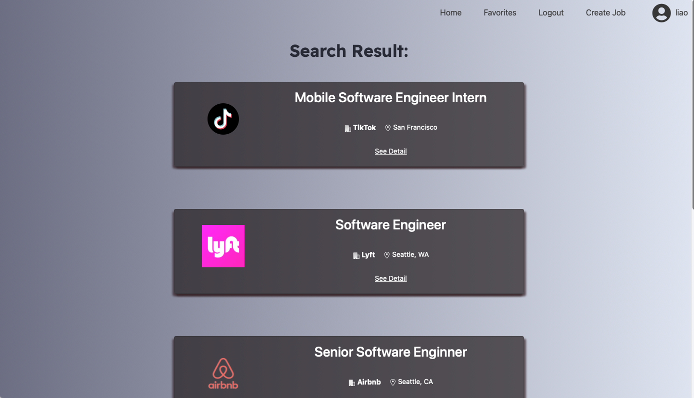
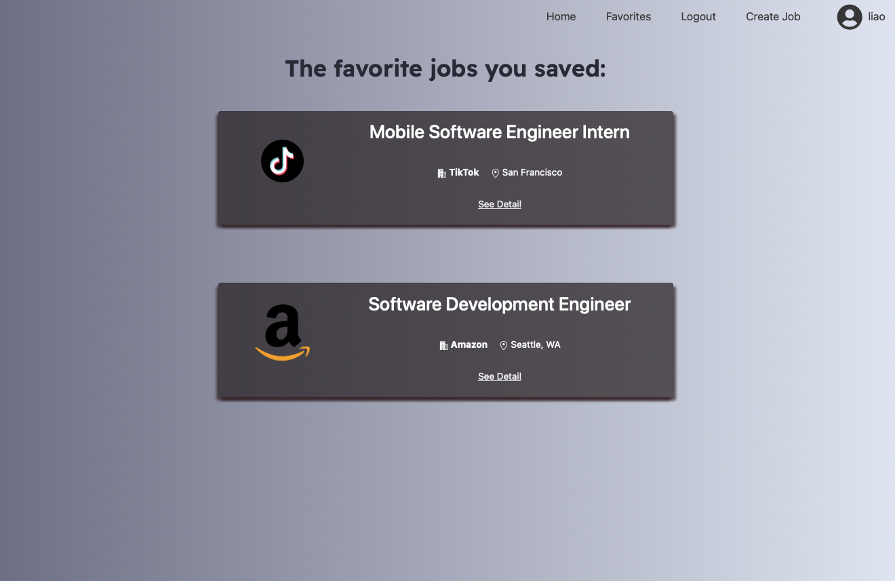
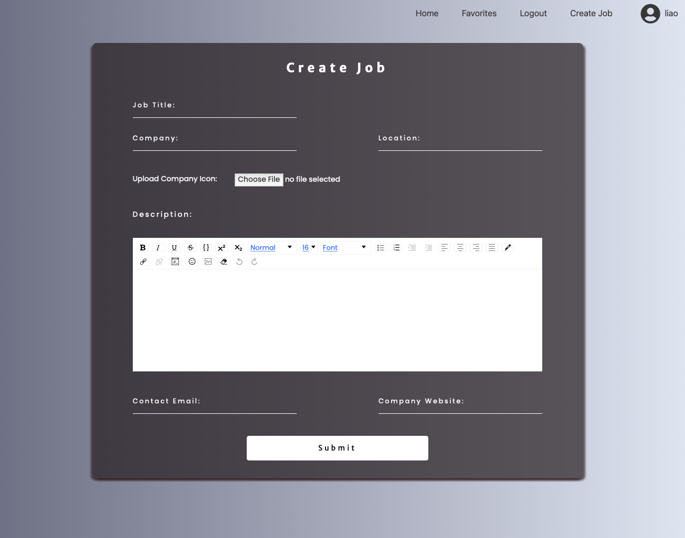

### The web link : https://job5610.herokuapp.com/

  
  
The web allows all people to search job using key word: 

      

  
  
It also supports user login/logout/register:      

       

  
  
the website will first show the search result with a list of jobs: 

       

  
  
If user click the detail button, they can see the detail of the page.  

There is also a "like/unlike" here for user to save/unsave the job.      

If the job is created by the current user, then edit/delete functions are implemented.  

       

  
  
The saved job for the current user will shown in the Favorite page.     
       

  
  
The Createjob page allows users to create job detail with rich text and company icons.    

       

  
  
The website is also designed in a mobile-friendy manner.    

